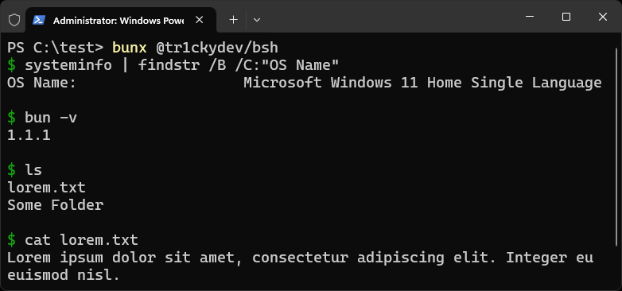

# bsh

Run bun shell as a standalone interactive shell.

```bash
bunx @tr1ckydev/bsh
```


### Commands

> [!CAUTION] 
> Many commands are under development and might not work as expected. If you find any issue report them in Bun's GitHub repository.

> [!TIP] 
> Use up/down arrow keys to navigate command history.

The following bash commands are available natively in bun shell.

| Command    | Description                                         |
| ---------- | --------------------------------------------------- |
| `cat`      | Concatenate files and print on the standard output. |
| `touch`    | Create, change and modify the timestamps of a file. |
| `mkdir`    | Create directories, if they do not already exist.   |
| `export`   | Display or export environment variables.            |
| `cd`       | Change the current working directory.               |
| `echo`     | Display a line of text.                             |
| `pwd`      | Output the current working directory.               |
| `which`    | Display the full path of (shell) commands.          |
| `rm`       | Remove files or directories.                        |
| `mv`       | Move or rename files and directories.               |
| `ls`       | List directory contents.                            |
| `exit`     | Exit the shell with an optional exit code.          |
| `true`     | Return a successful result.                         |
| `false`    | Return an unsuccessful result.                      |
| `yes`      | Repeatedly output a line with given string, or 'y'. |
| `seq`      | Print a sequence of numbers.                        |
| `dirname`  | Strip last component from a path.                   |
| `basename` | Print last component from a path.                   |
| `cp`       | Copy files and directories.                         |

...and all other commands available globally in the system.


### Flags

- `--version`: Print bsh and bun version.

- `-c`: Pass shell command as string to bsh and execute.

  ```bash
  bunx @tr1ckydev/bsh -c "pwd"
  ```

### Shell scripts

`.sh` files work as usual cross-platform and are executed through the bun shell interpreter.

### Known issues

- Using `cd` or other commands don't affect the next commands in the same session due to this [issue](https://github.com/oven-sh/bun/issues/9893).

This is an experimental project! File an issue if you find a bug or any weird behavior.


## License

This repository uses MIT License. See [LICENSE](https://github.com/tr1ckydev/bsh/blob/main/LICENSE) for full license text.
